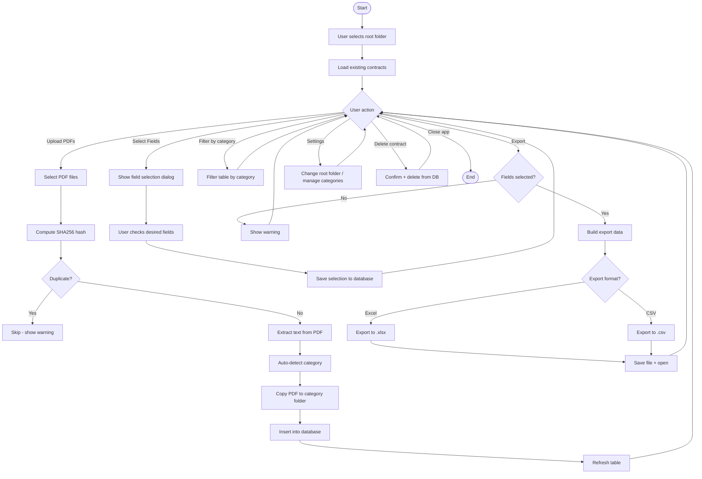

# ContractProcessor

Desktop application for extracting and managing data from insurance PDF contracts. Built for a small assurance organization - fully offline, single user, no authentication required.

---

## MVP Overview

**Goal:** Extract data from multiple PDF contracts (AT, AUTO, MRH, etc.), let users choose which fields to display in a final table, and export to Excel/CSV.

### Workflow

1. User uploads PDF contracts (drag-and-drop or file picker)
2. App auto-detects contract type (AT, AUTO, MRH) from PDF text
3. PDF text is extracted and stored
4. User selects which fields to keep (e.g., contract number, amount, dates)
5. Results displayed in a filterable table
6. User exports selected data to Excel or CSV

### Flowchart



### Contract Types

| Type | Description |
|------|-------------|
| AT | Assurance Temporaire (temporary life insurance) |
| AUTO | Automobile/vehicle insurance |
| MRH | Multirisque Habitation (home insurance) |
| *New types can be added dynamically via Settings* |

---

## Current Status

### Completed

- [x] Project structure (Forms, Models, Data, Services, Helpers, Constants)
- [x] SQLite database with contracts, categories, and settings tables
- [x] PDF text extraction using PdfPig
- [x] Auto-detection of contract categories from PDF text
- [x] Duplicate detection via SHA256 file hash
- [x] Export to CSV (CsvHelper) and Excel (ClosedXML)
- [x] Guna UI 2.0 controls for modern look
- [x] WinForms UI with upload, table view, field selection, export

### In Progress

- [ ] Testing with real PDF samples
- [ ] Refining field extraction patterns

### TODO

- [ ] OCR support for scanned PDFs (Tesseract)
- [ ] Manual category override during upload
- [ ] Remember field selection preferences
- [ ] Search/filter by date range
- [ ] ClickOnce deployment setup

---

## Tech Stack

| Component | Technology |
|-----------|------------|
| Language | C# (.NET 8) |
| UI | WinForms + Guna UI 2.0 |
| Database | SQLite (file-based, zero config) |
| PDF Parsing | PdfPig |
| Excel Export | ClosedXML |
| CSV Export | CsvHelper |
| Deployment | ClickOnce (planned) |

---

## Project Structure

```
ContractProcessor/
├── Forms/
│   ├── MainForm.cs              # Main window - upload, table, filter, export
│   ├── MainForm.Designer.cs
│   ├── FieldSelectionForm.cs    # Dialog to select fields
│   ├── FieldSelectionForm.Designer.cs
│   ├── SettingsForm.cs          # Root folder & category management
│   └── SettingsForm.Designer.cs
├── Models/
│   ├── Contract.cs              # Contract record model
│   └── AppSettings.cs           # User preferences model
├── Data/
│   ├── DatabaseInitializer.cs   # Create DB/tables on first run
│   └── DatabaseHelper.cs        # CRUD operations
├── Services/
│   ├── IPdfProcessor.cs         # PDF processing interface
│   ├── PdfProcessor.cs          # PdfPig text extraction
│   ├── IExportService.cs        # Export interface
│   ├── CsvExportService.cs      # CSV export
│   ├── ExcelExportService.cs    # Excel export
│   ├── ExportServiceFactory.cs  # Create correct exporter
│   └── SettingsService.cs       # Load/save app settings
├── Helpers/
│   ├── FileHashHelper.cs        # SHA256 duplicate detection
│   ├── CategoryDetector.cs      # Auto-detect AT/AUTO/MRH
│   └── NotificationHelper.cs    # Message dialogs
├── Constants/
│   └── AppConstants.cs          # Categories, status values, paths
└── Program.cs                   # Entry point
```

---

## Setup

1. Open `ContractProcessor.sln` in Visual Studio 2022
2. Build and run (F5)
3. Select a root folder when prompted (where contracts and data will be stored)

---

## Root Folder Structure

```
YourRootFolder/
├── Contracts/           # Uploaded PDFs organized by category
│   ├── AT/
│   ├── AUTO/
│   └── MRH/
├── Exports/             # Exported CSV/Excel files
└── AppData/
    └── contract_history.db   # SQLite database
```

---

## Database Schema

```sql
contracts (
    Id              INTEGER PRIMARY KEY AUTOINCREMENT,
    FileName        TEXT NOT NULL,
    FilePath        TEXT NOT NULL,
    Category        TEXT NOT NULL DEFAULT 'Unknown',
    FileHash        TEXT UNIQUE NOT NULL,
    UploadDate      DATETIME DEFAULT CURRENT_TIMESTAMP,
    ExtractedData   TEXT DEFAULT '{}',        -- JSON
    SelectedFields  TEXT DEFAULT '[]',        -- JSON
    ProcessingStatus TEXT DEFAULT 'Pending'
)

categories (
    Id   INTEGER PRIMARY KEY AUTOINCREMENT,
    Name TEXT UNIQUE NOT NULL
)

settings (
    Key   TEXT PRIMARY KEY,
    Value TEXT NOT NULL
)
```

---

## License

Internal use only.
